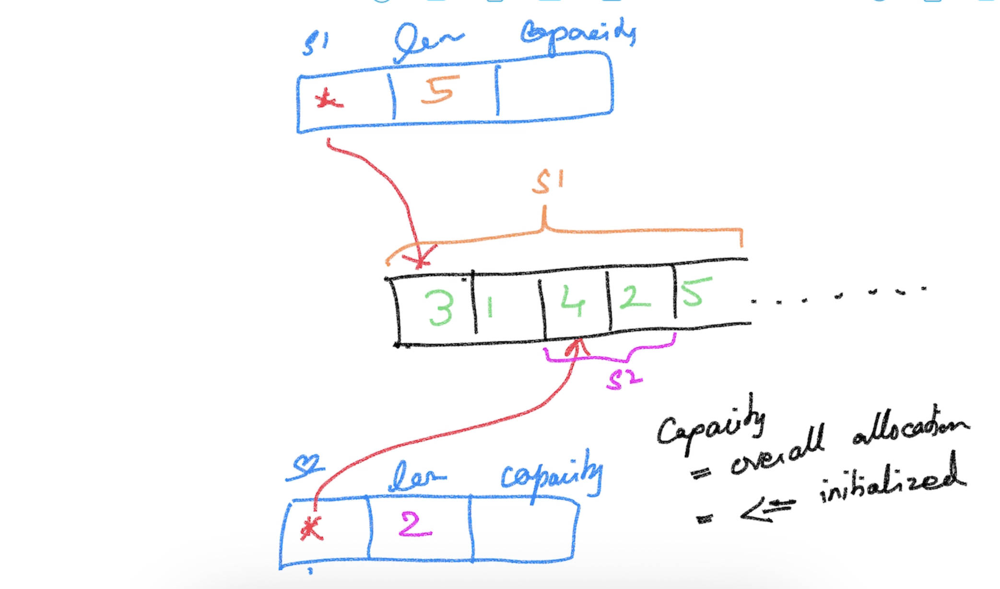

# Go Foundation #

## Magesh Kuppan ##
- tkmagesh77@gmail.com
- 99019-11221

## Methodology ##
- No powerpoints
- Discuss & Code
- No dedicated time for Q&A
- Repo (https://github.com/tkmagesh/Cisco-Go-Sep-2023)

## Schedule ##
- Commence      : 9:00 AM
- Tea Break     : 10:30 AM (20 mins)
- Lunch Break   : 12:00 PM (1 hr)
- Tea Break     : 3:00 PM (20 mins)
- Wind up       : 5:00 PM

## Software Requirements ##
- Go tools (https://go.dev/dl)
- Visual Studio Code (https://code.visualstudio.com)
- Go extension for VSCode (https://marketplace.visualstudio.com/items?itemName=golang.Go)

## Who Go? ##
- Performance
    - On par with C++
    - Close to the hardware
        - Compiled to native code
        - No JIT compilation
- Simpler
    - ONLY 25 keywords
    - No access modifiers (public, private, protected)
    - No classes (only structs)
    - No inheritance (only composition)
    - No reference types (everything is a value)
    - No pointer arithmatic
    - No exceptions (only errors)
    - No try-catch-finally construct
    - No implicity type conversions
    - No function overloading
    - No operator overloading
- Better Concurrency Model
    - Goroutines (~4KB vs 2MB of OS threads)
    - Built in scheduler to schedule the goroutines
    - N : M scheduler (N = # of goroutines & M = # of OS threads) where N >= M
    - Parallel execution is automatically taken care by the scheduler (when needed)

## Go Programs ##
- To run
    - > go run <filename.go>
- To build
    - > go build <filename.go>
    - > go build -o <binary_name> <filename.go>
- To get the list of supported platforms
    - > go tool dist list
- To get the go tool env variables
    - > go env
- To change the env variables
    - > go env -w <var_1>=<value_1> <var_2>=<value_2>
    - > ex: go env -w GOOS=windows GOARCH=386
- To cross compile
    - > GOOS=<target_os> GOARCH=<target_arch> go build <filename.go>
    - > ex: GOOS=windows GOARCH=386 go build 01-hello-world.go 

## Go Datatypes ##
- string
- bool

- int
- int8
- int16
- int32
- int64

- uint
- uint8
- uint16
- uint32
- uint64

- float32
- float64

- complex64 ( real[float32] + imaginary[float32] )
- complex128 ( real[float64] + imaginary[float64] )

- byte (alias for uint8)
- rune (alias for int32) (unicode code point)

## Variables ##
- var keyword
- := operator

## Variable Scopes ##
- function scope
    - ":=" is allowed
    - unused variables are not allowed
- package scope
    - cannot use ":=" syntax
    - unused variables are allowed
    
## Constants ##
- unused constants (at function / package scope is allowed)

## Constructs ##
- if else
- switch case
- for
- func

## Functions ##
- Can have more than 1 return result
- Support for variadic functions
    - the variadic parameter must be the final parameter
- Anonymous functions
- Higher Order functions
    - Assign functions as values to variables
    - Pass functions as arguments
    - Return functions as return values

## Errors ##
- Errors are values (objects)
- Object implements the "error" interface
- Error is not "thrown" but "returned" from a function
- Default value of an error variable is "nil"
- Ways of creating an error
    - errors.New()
    - fmt.Errorf()

## Deferred Functions ##
- functions whose execution is delayed until the current function execution is completed
- prefix the function call with "defer"
- can have any number of deferred functions in a function

## Panic & Recovery ##
### Panic ###
- state of the application that prevents the application execution to move forward
- Use the "panic()" function to programatically raise a panic (typically with an error)
### Recovery ###
- Use "recover()" function to get the error that resulted in the panic
- typically used in the deferred functions

## Collections ##
- Array
- Slice
- Map
### Array ###
- fixed sized collection of data of the same type
- memory is allocated and initialized with default values by default
- can also be initialized with custom values
### Slice ###
- varying sized collection of data of the same type
- Slice is a pointer to an underlying array
- use "append()" function to append new values
- use "copy()" function to create a copy with data
- use "cap()" function to get the capacity

